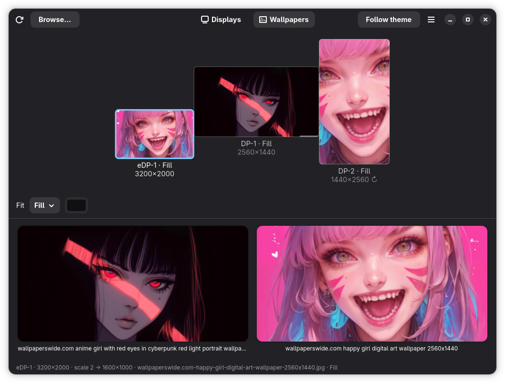

# Displaywright — the Omarchy wallpaper renderer

A different wallpaper on each display, with every fit mode Windows has.

Omarchy draws the desktop background from inside `omarchy-shell`, and that
renderer shows **one image on every display, always cropped to fill**. There is
no per-display picture and no choice of fit. This plugin replaces it with one
that takes both.



## ⚠️ It takes over the background layer

This plugin **replaces** `omarchy.background` rather than sitting beside it.
Both put an opaque surface on `WlrLayer.Background`, and Wayland defines no
order between two surfaces on the same layer — leaving both enabled means the
wallpaper you see is a coin flip per session.

`omarchy plugin add` will not do that for you, so do it yourself:

```bash
omarchy plugin add https://github.com/BlackKingBarOrg/displaywright-shell-plugin.git --enable
omarchy plugin disable omarchy.background
```

Displacing the built-in means inheriting its second job, and this plugin does:
it implements the whole `background` IPC target, so `omarchy-theme-bg-set`, the
SUPER + CTRL + SPACE background switcher and full theme switches all keep
working — palette transition included. Without that, a theme switch would stop
recolouring the bar.

To hand the layer back:

```bash
omarchy plugin remove ai.bkblab.displaywright
omarchy plugin enable omarchy.background
```

## What each display draws

An output this plugin has no opinion about keeps following the Omarchy theme
background, so a fresh install looks exactly like stock Omarchy. Everything
else is decided by one file:

`~/.config/displaywright/wallpapers.json`

```json
{
  "version": 1,
  "monitors": {
    "eDP-1": { "kind": "image", "path": "/home/you/a.jpg", "fit": "fill" },
    "DP-1":  { "kind": "image", "path": "/home/you/b.png", "fit": "center",
               "backdrop": "#101820" }
  },
  "span": null,
  "folders": []
}
```

The plugin watches the file, so editing it by hand takes effect immediately.
`span`, when set, wins over every entry in `monitors`. Anything unparseable is
dropped rather than raised on — a mangled entry costs you that wallpaper, never
your desktop. `folders` is ignored here; it belongs to the picker.

| `fit` | Windows | What it does |
|---|---|---|
| `fill` | Fill | Scales until the display is covered, crops the overflow. The default. |
| `fit` | Fit | Scales until the whole picture is visible, backdrop in the bars. |
| `stretch` | Stretch | Ignores the aspect ratio and distorts to fit exactly. |
| `tile` | Tile | Repeats the file at its own resolution from the top-left corner. |
| `center` | Center | Draws the file at its own resolution in the middle, backdrop around it. |
| — | Span | `"span"` at the top level: one picture across every display at once. |

Center and Tile are defined in **device pixels**, not layout pixels, so they
behave the way Windows' do on a scaled display — which is where most tools get
them wrong.

`kind` may be `image`, `color` (with `"color": "#101820"`) or `video`. Video
needs `qt6-multimedia-ffmpeg`; it type-checks clean but has not been run on
hardware yet, so treat it as untested.

## A window to drive it

Hand-editing JSON is the fallback, not the point. The GUI — display arrangement
on one page, a wallpaper picker with a live preview on the other — lives in the
main project:

**https://github.com/BlackKingBarOrg/displaywright**

Its `displaywright renderer install` installs this same renderer *and* disables
`omarchy.background` in one step, which is the easier path if you want both
halves.

## Requirements

- Omarchy 4.x with `omarchy-shell` (Quickshell)
- Hyprland
- `qt6-multimedia-ffmpeg`, for video wallpapers only

## This repository is generated

The source of truth is `plugin/` inside
[BlackKingBarOrg/displaywright](https://github.com/BlackKingBarOrg/displaywright),
published here with `git subtree split` so that `manifest.json` sits at a
repository root, which is what `omarchy plugin add` requires.

The renderer's fit arithmetic is duplicated in the main repo's
`displaywright/wallpapers/preview.py`, so that the GUI preview and the glass
agree; changing one without the other makes the preview lie. That is why the
two live in one repository, and why **issues and pull requests belong on the
main repo**, not here — changes pushed here are overwritten by the next
publish.

## License

MIT — see [LICENSE](LICENSE).
